This is a [Next.js](https://nextjs.org/) project bootstrapped with [`create-next-app`](https://github.com/vercel/next.js/tree/canary/packages/create-next-app).

## Getting Started

First, run the development server:

```bash
npm run dev
# or
yarn dev
# or
pnpm dev
# or
bun dev
```

Open [http://localhost:3000](http://localhost:3000) with your browser to see the result.

You can start editing the page by modifying `app/page.tsx`. The page auto-updates as you edit the file.

This project uses [`next/font`](https://nextjs.org/docs/basic-features/font-optimization) to automatically optimize and load Inter, a custom Google Font.

## Laporan Praktikum

|  | Pemrograman Berbasis Framework 2025 |
|--|--|
| NIM |  2241720067|
| Nama |  Febby Mathelda Silvya Mooy |
| Kelas | TI - 3D |


### PERSIAPAN

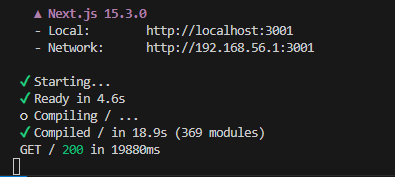

Hasil Browser:

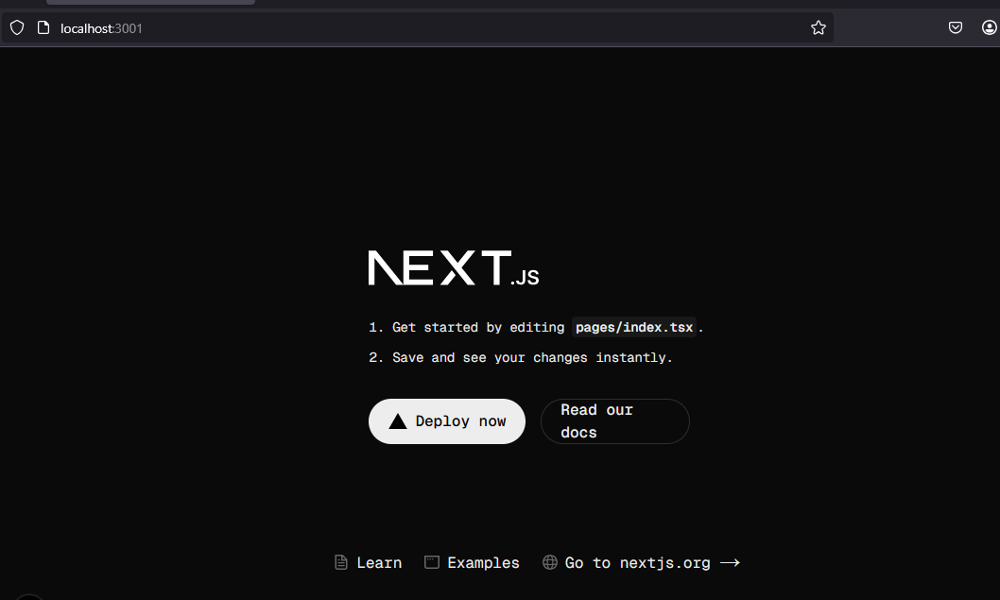

### B. Membuat Halaman dengan Server-Side Rendering (SSR)

1. Buka file pages/index.tsx di text editor Anda

2. Ganti kode di dalamnya dengan kode berikut untuk membuat halaman sederhana:

Hasil:

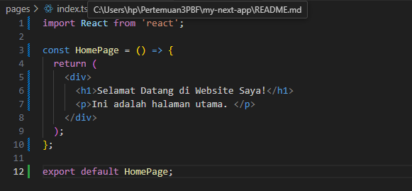

3. Simpan file dan lihat perubahan di browser. Anda akan melihat halaman utama dengan teks
"Selamat Datang di Website Saya!".

Hasil:

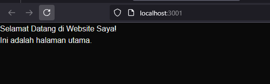

### C. Menggunakan Static Site Generation (SSG)

1. Buat file baru di direktori pages dengan nama blog.js.

2. Tambahkan kode berikut untuk membuat halaman blog dengan SSG:

Hasil:

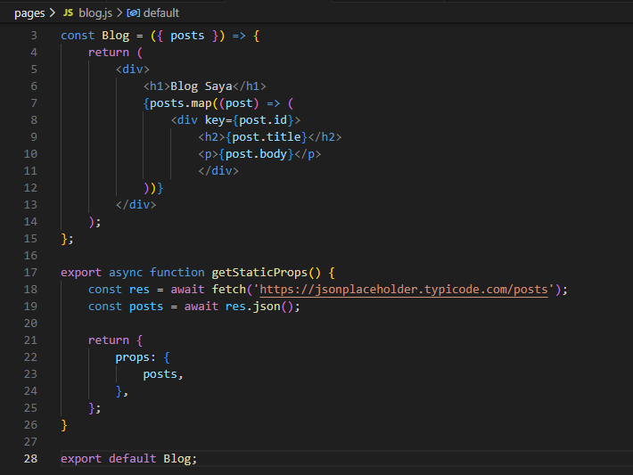

3. Simpan file dan buka http://localhost:3000/blog di browser. Anda akan melihat daftar post yang
diambil dari API eksternal.

Hasil:

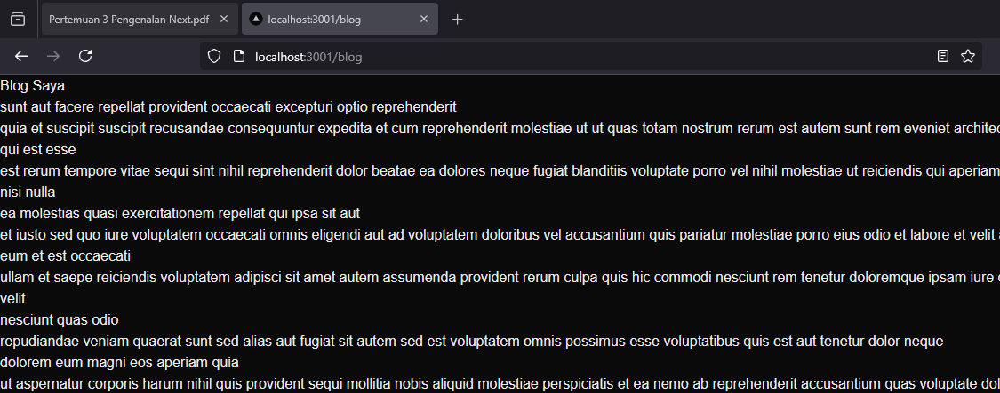

### D. Menggunakan Dynamic Routes

1. Buat direktori baru di pages dengan nama blog.

2. Buat direktori baru di pages dengan nama blog.

3. Tambahkan kode berikut untuk membuat halaman dinamis berdasarkan slug

Hasil:

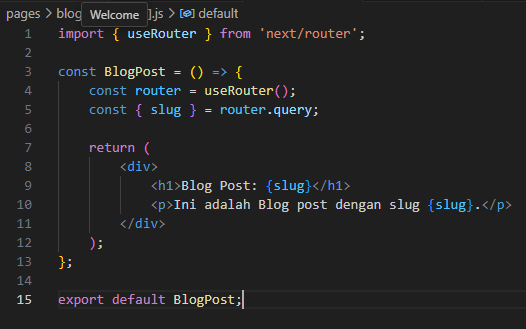

4. Simpan file dan buka http://localhost:3000/blog/contoh-post di browser. Anda akan melihat
halaman yang menampilkan slug dari URL.

Hasil:

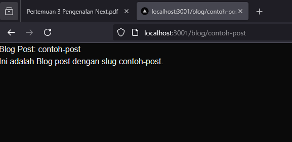

### E. Menggunakan API Routes

1. Pastikan terdapat direktori di pages dengan nama api.

2. Buat file di dalam direktori api dengan nama products.js.

3. Tambahkan kode berikut untuk membuat API route yang mengembalikan daftar produk:

Hasil:

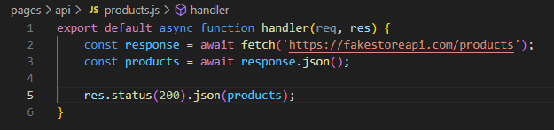

4. Buat file baru di pages dengan nama products.js untuk menampilkan daftar produk:

Hasil:

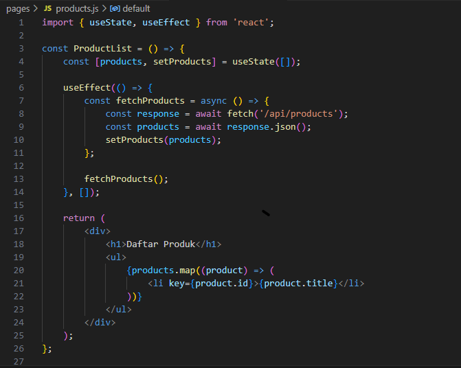

5. Simpan file dan buka http://localhost:3000/products di browser. Anda akan melihat daftar
produk yang diambil dari API route.

Hasil:

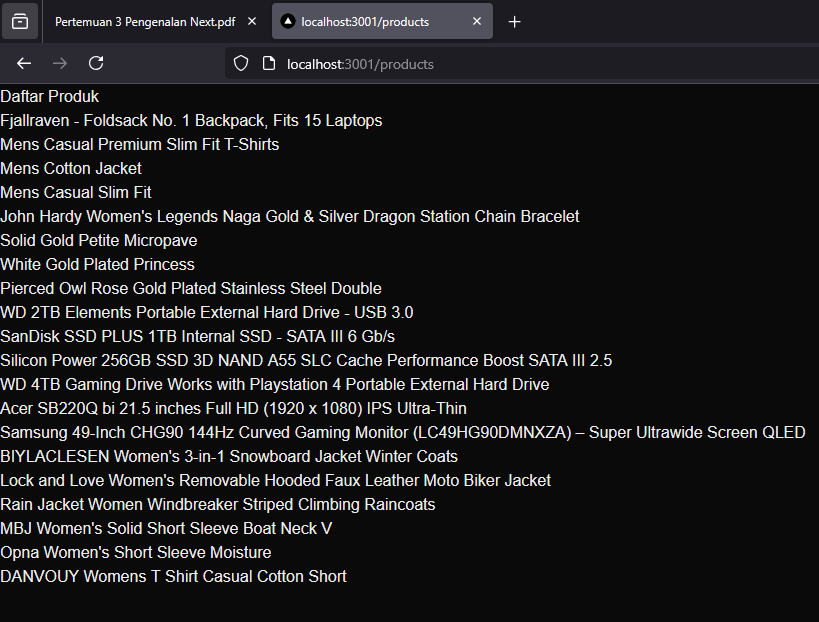

### F. Menggunakan Link Component

1. Buka file pages/index.tsx dan tambahkan modif dengan kode berikut untuk membuat link ke
halaman lain:

Hasil:

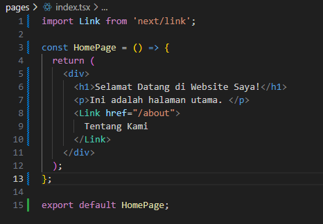

2. Buat file baru di pages dengan nama about.js untuk halaman "Tentang Kami":\

Hasil:

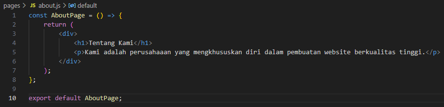

3. Simpan file dan buka http://localhost:3000 di browser. Klik link "Tentang Kami" untuk navigasi
ke halaman tentang.

Hasil:

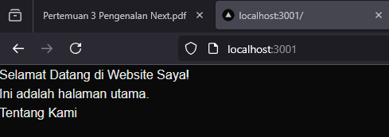

Setelah mengklik "Tentang kami"

Hasil:

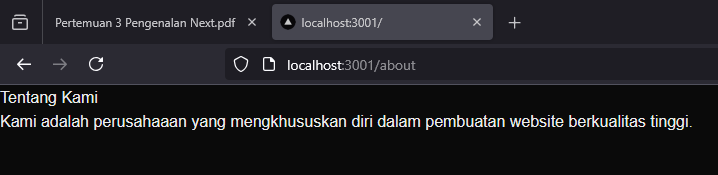